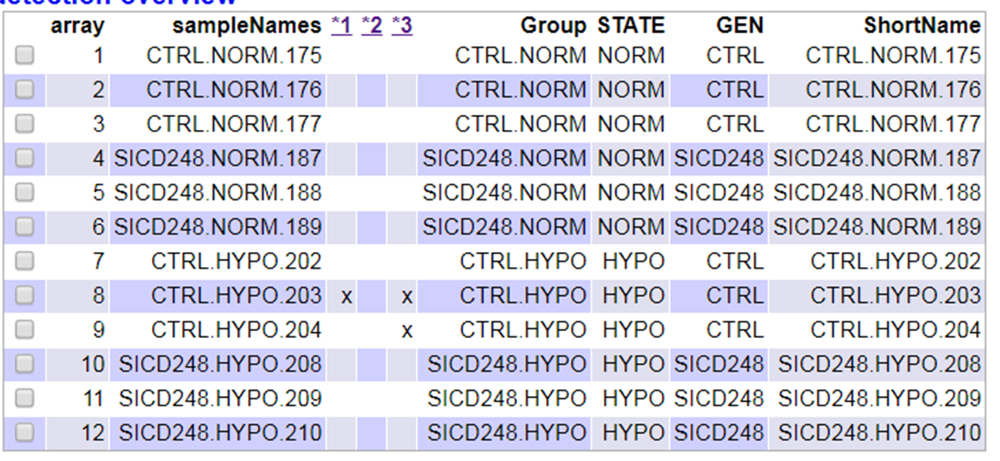
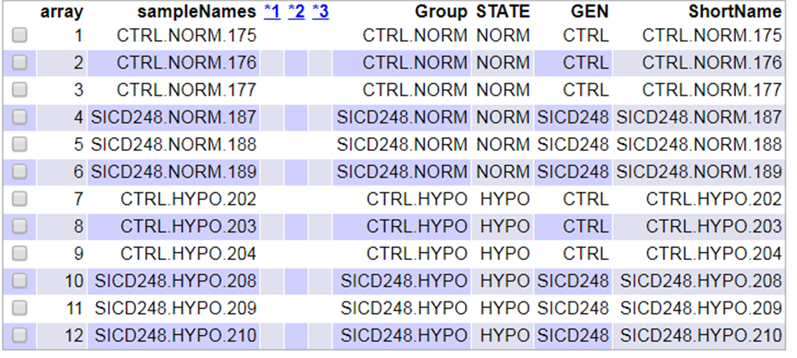

```{r setup, include=FALSE}
library(knitr)
knitr::opts_chunk$set(echo = TRUE, message = FALSE, warning = FALSE, 
                      comment = NA, prompt = TRUE, tidy = FALSE, 
                      fig.width = 7, fig.height = 7, fig_caption = TRUE,
                      cache=FALSE)
Sys.setlocale("LC_TIME", "C")
```

```{r echo=FALSE}
if(!(require(printr))) {
  install.packages(
    'printr',
    type = 'source',
    repos = c('http://yihui.name/xran', 'http://cran.rstudio.com')
  )
}
```

El present informe i les seves dades es pot consultar a https://github.com/MagdaPla/ADO-PEC1.git

# 1. Abstract

En aquest document es proposa una metodologia amb el codi en R complet per a realitzar un procés d'anàlisis de microarrays (tipus Affimetrix) a partir de les dades brutes descarregables des del repositori GEO. Es realitza en mode d'exemple l'anàlisis de les dades de l'estudi GSE131667, que analitza l'expressió genètica de la glicoproteïna transmembrana CD248 i el seu impacte en el metabolisme del teixít adipós blanc (WAT) i malalties metabòliques. El document també conté informació complementària per si es desitga ampliar els anàlisis amb un altre grup de dades òmiques. 

# 2. Objectius

L'objectiu principal del document és tenir una proposta d'anàlisis a realitzar amb el codi corresponent, correctament documentat d'informació bruta del repositori GEO en format `.CEL` utilitzant Bioconductor amb R i altres eines pròpies d'anàlisis de informació genètica.  

# 3. Material i mètodes 

## 3.1.Naturalesa de les dades

Les dades utilitzades s'han descarregat del repositori web de lliure accés GEO (Gene Expression Omnibus a https://www.ncbi.nlm.nih.gov/geo/browse/?view=series&zsort=date&display=100&page=4), concretament s'ha descarregat el treball amb codi GSE131667 (https://www.ncbi.nlm.nih.gov/geo/query/acc.cgi?acc=GSE131667), publicat per @Petrus2019. 
És conegut que un balanç energètic positiu afavoreix l’expansió del teixit adipós blanc (WAT) que es caracteritza per l’activació d’un repertori d’esdeveniments que inclouen hipòxia, inflamació i remodelació de la matriu extracel·lular. La glicoproteïna transmembrana CD248 està implicada en tots aquests processos en diferents malalties malignes i inflamatòries, però no s'ha explorat el seu impacte potencial en el WAT i en les malalties metabòliques. En el treball publicat a @Petrus2019 s'evalua el paper de CD248 en la funció d’adipòcits i el metabolisme de la glucosa mitjançant anàlisis d’omics en WAT humà, knockdowns de gens en adipòcits diferenciats in vitro humans. A nivell experimental, les cèl·lules mare derivades del teixit adipós humà es van diferenciar per adipòcits in vitro. Al final de la diferenciació, es van tractar les cèl·lules amb siRNA dirigit al CD248 seguit d'exposició a nivells d'oxigen de l'1%. Es va realitzar una anàlisi de microarrays per identificar gens regulats de manera diferent. L'experiment concret amb aquestes dades proporciona informació sobre els gens expressats diferencialment per a la disminució de CD248 i com la resposta a la hipòxia està influenciada per un nivell reduït de CD248. Al final de la diferenciació, es van fixar les cèl·lules per obtenir ARN.

S'ha utilitzat el microarrays tipus Affymetrix [Clariom_S_Human] i es comparen un grups control amb siCD248 en condicions normals d'oxigen i un altre grup control amb siCD248 en condicions d'hipòxia. De cada grup s'han realitzat 3 rèpliques.


## 3.2 Mètodes utilitzats en l'anàlisis

Per a començar es preparen els directoris on s'emmagatzemaran les dades brutes descarregades de la web, directoris on es desaran els resultats i figures necessàries per a realitzar l'informe final. També es realitzarà la instal·lació de les llibreries necessàries. Una vegada la part més tècnica estigui a punt, es procedeix a realitzar l'anàlisis de microarrays seguint la metodologia proposada a @GonzaloSanz2019, la qual segueix els següents passos: 

1. Identificar els grups y quins grups pertanyen a cada mostra. 
2. Control de qualitat de les dades crues
3. Normalizació
4. Control de qualitat de les dades normalitzades
5. Filtratge no específic
6. Identificació de genes diferencialment expresats
7. Anotació dels resultats
8. Comparació entre diferents comparacions 
9. Anàlisis de significació biològica (“Gene Enrichment Analysis”)


## 3.3.Procediment

Abans de començar pròpiament l'anàlisis es preparen els directoris on emmagatzemar les dades i els resultats. És molt important estructurar la informació, desar-la en directoris diferents segons la seva funció. Tenir la informació correctament endreçada facilitat molt tot el procés, treballar cooperativament amb altres investigadors, etc. Aquest punt es pot fer des de R o bé directament creant els directoris des d'un explorador de windows. Per a fer-ho des de R:
```{r}
# aquest codi només el fem la primera vegada per crear directoris
setwd(".")

# directori on desar les dades de partida: dades brutes en foramt .CEL i el fitxer "targets.csv" 
dir.create("data")

# directori on es dirigiran automàticament els resultats
dir.create("results")

# també es crea el directori "figures" on es desen figures necessàries per a documentar l'informe
# igualment pot ser molt necessari crear aquest directori per a guardar figures amb el mateix propòsit
# per a realitzar els informes d'altres dades.
dir.create("figures") 
```

Convé tenir instal·lades les següents llibreries. Com que algunes llibreries són grans i el procés d'instal·lació és llarg es recomana instal·lar-les només si és necessari (quan no es tenen o convé actualitzar-les) 
```{r}
# per una banda convé instalat Bioconductor:

#if (!requireNamespace("BiocManager", quietly = TRUE))
#     install.packages("BiocManager")
#BiocManager::install()

#Juntament amb altres paquets específics que es van carregant al llarg del procés i
#alhora, algun paquet d'anotacions també de Bioconductor i altra informació complementària. 

```


### 3.3.1. Identificar els grups y quins grups pertanyen a cada mostra

A continuació hem preparat el fitxer "target.csv" a partir de la informaicó descrita a l'experiment (https://www.ncbi.nlm.nih.gov/geo/query/acc.cgi?acc=GSE131667). El fitxer csv és de la setÜent manera:
```{r}
# veiem primer la taula que hem construit, anomenant-la "targets"
targets <- read.csv2("./data/targets.csv", header = TRUE, sep = ";") 
# té la següent forma
knitr::kable(
   targets, booktabs = TRUE,
   caption = 'Content of the targets file used for the current analysis')
```

A continaució es procedeix a llegir propiament els fitxers .CEL (dades brutes o raw data). Es crearà la variable "rawData:
```{r}
# ara llegim la mateixa taula creant una nova variable "my.targets"
# ho fem amb `read.AnnotatedDataFrame()` així ho associem amb els fitxers .CEL
library(oligo)   # carregar aquesta llibreria tarda una miqueta
celFiles <- list.celfiles("./data", full.names = TRUE)
library(Biobase)
my.targets <-read.AnnotatedDataFrame(file.path("./data","targets.csv"), 
                                      header = TRUE,
                                      row.names = 1,
                                      sep=";") 
rawData <- read.celfiles(celFiles, phenoData = my.targets) 
# amb aquesta funció s'ha baixat el paquet d'anotacions requerit ("pl.clarioms.human") 
print(pData(rawData)) #una manera de veure el fitxer targets.csv amb la informació bruta

my.targets@data$ShortName->rownames(pData(rawData))
colnames(rawData) <-rownames(pData(rawData)) 

# veiem les metadades de la taula
head(rawData)
class(rawData)
```
Si mirem la classe de les dades brutes s'observa que són `expressionFeatureSet` enlloc de l'esperat `expressionSet`.

### 3.3.2. Control de qualitat de les dades crues

Es fa un control de la qualitat de les dades. La llibreria utilitzada `arrayQualityMetrics()` realitza diferents testos de qualitat. Aquest procés és una miqueta lent anivell de processament, especialment si el nombre de mostres és elevat.

```{r}
library(arrayQualityMetrics)
#a banda d'executar la funció de control de qualitat 
# també se li indica que creei un directori dins de la carpeta de resultats:"rawData_quality"
# en aquest directori es desarà tota la informació referent al control de qualitat
arrayQualityMetrics(rawData, outdir = "./results/rawData_quality", force = T)
```
El resultat de tot l'anàlisis de qualitat es resum en el fitxer "index.html" emmagatzemat dins de la carpeta de "results". En la taula següent, les columnes 1,2 i 3  mostren tres criteris diferents per a mesurar la qualitat de les dades. En els casos que es marca una creu convé que es tingui un especial interès en aquesta informació. En l'exemple següent 1 mostra s'ha marcat en dues columnes i una altra mostra en una sola columna, això pot indicar que els problemes potencials de les dades poden ser pocs, per tant, es podrien mantenir totes les dades.

*NOTA: la figura següent s'ha generat a partir d'una captura de pantalla del fitxer "index.htm" i s'ha desat com a .png en el directori de figures*

```{r QCRawDataRes, fig.cap="Figura 1. Taula resum de la qualitat de les dades, extret del fitxer index.html produït per la arrayQualityMetrics() sobre les dades brutes", echo=FALSE}

```

A més, es poden aplicar altres anàlisis de qualitat: 
**A) Anàlisis de components principals.**
A partir d'una funció definida per @GonzaloSanz2019 es crea una gràfica amb les dues components principals:

```{r}
library(ggplot2)
library(ggrepel)
# ´la següent funció prepara i edita una PCA 
plotPCA3 <- function (datos, labels, factor, title, scale,colors, size = 1.5, glineas = 0.25) {
  data <- prcomp(t(datos),scale=scale)
  # plot adjustments
  dataDf <- data.frame(data$x)
  Group <- factor
  loads <- round(data$sdev^2/sum(data$sdev^2)*100,1)
  # main plot
  p1 <- ggplot(dataDf,aes(x=PC1, y=PC2)) +
    theme_classic() +
    geom_hline(yintercept = 0, color = "gray70") +
    geom_vline(xintercept = 0, color = "gray70") +
    geom_point(aes(color = Group), alpha = 0.55, size = 3) +
    coord_cartesian(xlim = c(min(data$x[,1])-5,max(data$x[,1])+5)) +
    scale_fill_discrete(name = "Group")
  # avoiding labels superposition
  p1 + geom_text_repel(aes(y = PC2 + 0.25, label = labels),segment.size = 0.25, size = size) + 
    labs(x = c(paste("PC1",loads[1],"%")),y=c(paste("PC2",loads[2],"%"))) +  
    ggtitle(paste("Anàlisis de components principals de:",title,sep=" "))+ 
    theme(plot.title = element_text(hjust = 0.5)) +
    scale_color_manual(values=colors)
}
```

```{r PCARaw, message=FALSE, fig.cap="Figura 2.Components principals de les dades brutes"}
plotPCA3(exprs(rawData), labels = targets$ShortName, factor = targets$Group,
         title = "Dades brutes",scale = FALSE, size = 3, 
         colors = c("violet", "gold","green","brown"))
```
El gràfic mostra com les dues primers components principals expliquen un 64% de la variabilitat però no es veuen patrons molt clars que difenciïn els diferents grups de dades. Hi ha una tendència a que els grups amb condicions  normals d'oxigen estan a la meitat esquerra de l'eix de les X (Component Principal 1) i els grups amb hipòxia a la banda dreta, així com també s'observa una certa tendència a que els grups control tenen valors més elevats de la Component principal 2. Però hi ha grups que no segueixen clarament aquest patró.

**B) Distribució de les intensitats**
També es pot realitzar una figura de distribució de les intensitats:
```{r BoxplotRaw, message=FALSE, fig.cap="Figura 3.Boxplot de les dades brutes"}
boxplot(rawData, cex.axis=0.5, las=2,
        which="all", 
        col = c(rep("violet", 3), rep("gold", 3),rep("green", 3),rep("brown", 3)),
        main="Distribució de la intensitat de les dades brutes",
        ylim = c(0,20))
```
La figura no mostra grans discrepàncies entre totes les mostres, tal i com s'esperaria en les dades brutes.

### 3.3.3.Normalizació

Per tal de disminuïr les diferències que hi puguin haver entre les mostres degut a les tècniques emprades i no a diferències biològiques, és necessari normalitzar les dades, així es poden comparar i realitzar realment una comparació diferencial de l'expressió genètica. El mètode de normalització utilitzat és un dels més comuns: *Robust Multichip Analysis* i es descriu a @rmaIri

```{r}
eset_rma <- oligo::rma(rawData)
eset_rma
class(eset_rma)
#Es desen les dades normalitzades en un fitxer .csv
write.csv2(exprs(eset_rma), file="./results/normalized.Data.csv")
```

Al fer la normalització veiem que el tipus de dades ja són un `ExpreessionSet`.

A continuació s'incorporen les anotacions perquè es necessitaran per les funcions de més endavant. En aquest cas les anotacions estan en el fitxer *pd.clariom.s.human* i la millor manera per a afegir les anotacions en aquest cass és amb el paquet *"affycoretools"*. Sovint hi ha diferents maneres de fer aquest procediment, cercant el nom del paquet d'anotacions i com afegir-les al fitxer de dades es pot buscar a la web de Biococnductor o altres fonts, la millor manera de realitzar el procés:
```{r}
#BiocManager::install("affycoretools")
library(affycoretools) 
all.eset <- annotateEset(eset_rma, annotation(eset_rma))
all.eset

# es pot dessar també la inforamció normalitzada amb les anotacions 
write.csv(exprs(all.eset), file="./results/normalized_annotated.Data.csv")
```
Veiem que en les anotacions s'ha incorporat informació dels següents camps: *"PROBEID"*, *"ID"*, *"SYMBOL"* i *"GENENAME"*, tal i com es descriu `fvarLabels` al veure "all.eset". Això és rellevant alhora d'escriure el codi per a les següents funcions doncs molt codi està preparat per paquets d'anotacions que contenen columnes etiquetades com "ENTREZID", etc.

### 3.3.4. Control de qualitat de les dades normalitzades

Tornem a realitzar els processos de control de qualitat descrits en el punt 2 però sobre les dades normalitzades, que hem anomenat "eset_rma"
```{r}
arrayQualityMetrics(eset_rma, outdir = file.path("./results", "QCDir.Norm"), force=TRUE)
```
La taula resum del fitxer "index.html":
```{r QCNormalDataRes, fig.cap="Figura 4. Taula resum de la qualitat de les dades, extret del fitxer index.html produït per la arrayQualityMetrics() sobre les dades normalitzades", echo=FALSE}

```
Els resutlats d'aquest anàlisis de qualitat semblen indicar que la qualitat de les dades hagi augmentat. Ara només destaca dues mostres només en un dels anàlisis com de qualitat menor.

Els anàlisis de components principals:
```{r PCANorm, message=FALSE, fig.cap="Figura 5.Components principals de les dades normalitzades"}
plotPCA3(exprs(eset_rma), labels = targets$ShortName, factor = targets$Group,
         title = "Dades normalitzades",scale = FALSE, size = 3, 
         colors = c("violet", "gold","green","brown"))
```
La gràfica amb les dades normallitzades mostra com les dues primeres components principals expliquen gairebé un 60% de la variació, a més, a diferència de les dades sense normalitzar es diferencien 4 grups ben separats corresponents als 4 grups de dades. 


La distribució de les dades normalitzades s'ha uniformitzat en comparació a les dades sense normalitzar, tal i ocm es veu a la figura següent:
```{r BoxplotNorm, message=FALSE, fig.cap="Figura 6.Boxplot de les dades normalitzades"}
boxplot(eset_rma, cex.axis=0.5, las=2,
        which="all", 
        col = c(rep("violet", 3), rep("gold", 3),rep("green", 3),rep("brown", 3)),
        main="Distribució de la intensitat de les dades normalitzades",
        ylim = c(0,15))
```

La expressió gènica dels microarrays pot se deguda a diferents fonts d'error, una podria ser la data amb que s'ha processat. Per saber si la data del processament realitzem:
```{r}
library(affyio)
get.celfile.dates(celFiles)
```
En aquest cas totes les mostres s'ha processat en la mateixa data: 21/08/2018. Per tant la data no pot ser una font de variació. 

Així que es mirarà altres possibles fonts de variació. Es realitza un histograma on cada barra representarà i quantifica la font de variació inclosa en l'anàlisis. En aquest cas la proporció d'oxigen definida en el camp "STATE" i si es tracta de una mostra control o bé la glicoproteina CD248 tractada, descrita en el camp "GEN":  
```{r}
#BiocManager::install("pvca")
library(pvca)

pData(eset_rma) <- targets
#select the threshold
pct_threshold <- 0.6
#select the factors to analyze
batch.factors <- c("STATE", "GEN")
#run the analysis
pvcaObj <- pvcaBatchAssess(eset_rma, batch.factors, pct_threshold)


#plot the results
bp <- barplot(pvcaObj$dat, xlab = "Efectes",
 ylab = "Variació de la proporció mitjana ponderada",
 ylim= c(0,1.1),col = c("mediumorchid"), las=2,
 main="Estimació PVCA")
axis(1, at = bp, labels = pvcaObj$label, cex.axis = 0.75, las=2)
values = pvcaObj$dat
new_values = round(values , 3)
text(bp,pvcaObj$dat,labels = new_values, pos=3, cex = 0.7)
```
Els resultats mostren com que la principal variació és deguda a la quantitat d'oxigen a la que es sotmeten les mostres. Aquest és un factor experimental incorporat en l'anàlisis, per tant, és esperable que suposi una variació important.  Així doncs, queden descartades fonts de variació degudes a aspectes metolològics de l'experiment propiament. 

Per altra banda, si un gen s’expressa diferencialment, s’espera que hi hagi una certa diferència entre els grups i, per tant, la variació global del gen serà més gran que la dels que no tenen expressió diferencial. Dibuixar la variabilitat general de tots els gens és útil per decidir quin percentatge de gens mostra una variabilitat que es pot atribuir a altres causes que no pas la variació aleatòria. 

Es realitza un anàlisis de la desviació estàndard i es considera que els gens més variables són aquells que tenen una desviació estàndard per sobre del 90-95%.

Es calcula la desviació estàndard per a cada gen i s'ordenen els resultats. Aquests càlculs es realitza sobre els gens filtrats (eset_filtered)
```{r}
sds <- apply (exprs(eset_rma), 1, sd)
sdsO<- sort(sds)
```

Es representen els resultats en una gràfica, ordenant de menys a més  les desviacions estàndard de tots els gens. La línia vertical representa els gens més variables, amb una desviació estàndard per sobre del 90-95% de totes les desviacions estàndard.
```{r BoxplotFilt, message=FALSE, fig.cap="Figura 7.Distribució de la variabilitat de les dades filtrades"}
plot(1:length(sdsO), sdsO, sub="Les línies verticals representa els percentils 90% i 95% ",
     xlab="Índex de gens (de menys a més variabilitat)", ylab="Desviació estàndard")
abline(v=length(sds)*c(0.9,0.95))
```


### 3.3.5. Filtrat dels resultats

Hi ha gens pels quins la seva variació pot ser atribuïda a una variabilitat aleatoria. Aquests gens es poden filtrar. Aquest procés es pot realitzr amb la llibreria `genefiltre` i la funció `nsfilter()`, cal però la informació d'un paquet amb anotacions sobre l'estudi en concret que ajudarà a realitzar el filtrat. Aquest paquet d'anotacions es pot trobar a http://www.bioconductor.org/packages/release/data/annotation/. També es descriu el paquet d'anotacions utilitzat quan s'ha executat `head(rawData)`, al final de la informació mostrada. 

És possible que per alguns estudis en concret no existeixi aquesta informació, potser cal esperar una nova versió de Bioconductor. 

L'estudi seguit en aquest exemple no ha permès instal·lar correctament el paquet d'anotacions, per tant no es podrà utilitzar aquesta informació i es realitzarà un filtrat com el següent:
```{r}

library(genefilter)

# Com que en les anotacions no hi havia la entrada ENTREZ indico les entrades amb ENTREZ falses
# es deixen la funció IQR i el punt de tall 0.5 que la funció té per defecte
filtered <- nsFilter(all.eset,
                     require.entrez = FALSE, remove.dupEntrez = FALSE,
                     var.filter=TRUE, var.func=IQR, var.cutoff=0.5,
                     filterByQuantile=TRUE)

# per a veure els resultats del filtrat
filtered$eset
filtered$filter.log

eset_filtered <-filtered$eset

# la informaicó filtrada amb les anotacions es desa com a .csv:

write.csv(exprs(eset_filtered), file="./results/normalized.Filtered.Data.csv")
```
Segons "filtered$eset" hem passat de *27189* dades a "eset_rma" a *13561* a "eset_filtered". 

*NOTA: No tinc clar si ha eliminat duplicats al no poder-li dir que remoqui "dupEntrez".*


### 3.3.6. Identificació de genes diferencialment expresats

La identificació de gens expressats diferencialment consisteix bàsicament en comparar l'expressió gènica entre grups. Existeixden diferents metodologies però en aquest procés s'utlitzarà el Lineal Models for Microarrays, implementat al paquet `limma` igual que en el treball de @rmaIri.

El primer pas per a l’anàlisi basat en models lineals és crear la matriu de disseny. Bàsicament es tracta d’una taula que descriu l’assignació de cada mostra a un grup o condició experimental. Té tantes files com mostres (en aquest cas 12) i tantes columnes com grups (en aquest cas 4). Cada fila conté una a la columna del grup al qual pertany la mostra i un zero a les altres. La matriu de disseny es pot definir manualment o a partir d’una variable de factor que pot haver estat introduïda al fitxer “targets.csv” amb aquest objectiu creat específicament per a ell. En aquest estudi:

```{r}
library(limma)
designMat<- model.matrix(~0+Group, pData(eset_filtered))
colnames(designMat) <- c("CTRL.HYPO","CTRL.NORM","SICD248.HYPO","SICD248.NORM")
print(designMat)
```

A continuació es defineix la **Matriu de Contrast** per escriure les comparacions entre grups de dos en dos. Conté tantes columnes com comparacions (en aquest exemple seran 3) i tantes files com grups (en aquestes dades 4 grups). En aquest exemple es realitzen tres comparacions, basicament enfocades a veure diferències entre els control amb els siCD248 en concentració normal d'oxigen (NORM) i el mateix però en hipòxia (HYPO). Es realitzat una tercera comparació entre grups els grups anteriors (INTR). 

```{r}
cont.matrix <- makeContrasts (NORM = CTRL.NORM-SICD248.NORM,
                              HYPO = CTRL.HYPO-SICD248.NORM,
                              INTR = (CTRL.NORM-SICD248.NORM) - (CTRL.HYPO-SICD248.NORM), 
                              levels=designMat)
print(cont.matrix)
```

Una vegada definides la matriu de disseny i els contrastos, podem procedir a l'estimació del model, a estimar els contrastos i a realitzar proves de significació que conduiran a la decisió, per a cada gen i cada comparació, si es poden considerar expressades diferencialment. També s'utilitzarà el paquet `limma`
```{r}
#library(limma)
fit<-lmFit(eset_filtered, designMat)
fit.main<-contrasts.fit(fit, cont.matrix)
fit.main<-eBayes(fit.main)
head(fit.main)
class(fit.main)

results<-decideTests(fit.main)
summary(results)
```

La funció `topTABLE()` proporciona els estadístics habituals de proves: com ara els p-valors moderats o ajustats que s'utilitzen per ordenar els gens que s'expressen de manera de més a menys diferenciats en un contrast, alhora, per si de cas faig que es treguin els registres amb NA (sense dades):
```{r}
#construïm una taula amb la informació de la comparació
topTAB_NORM_0 <- topTable (fit.main, number=nrow(fit.main), coef="NORM", adjust="fdr") 
# es mostren només els resultats dels primers gens
topTAB_NORM <- na.omit(topTAB_NORM_0)
h_NORM <- head(topTAB_NORM)
knitr::kable(
   h_NORM, booktabs = TRUE,
   caption = 'NORM')

topTAB_HYPO_0 <- topTable (fit.main, number=nrow(fit.main), coef="HYPO", adjust="fdr") 
topTAB_HYPO <- na.omit(topTAB_HYPO_0)
h_HYPO <- head(topTAB_HYPO)
knitr::kable(
   h_HYPO, booktabs = TRUE,
   caption = 'HYPO')

topTAB_INTR_0 <- topTable (fit.main, number=nrow(fit.main), coef="INTR", adjust="fdr") 
topTAB_INTR <- na.omit(topTAB_INTR_0) 
h_INTR <- head(topTAB_INTR)
knitr::kable(
   h_INTR, booktabs = TRUE,
   caption = 'INTR')

```

També es pòden mostrar gràficament els resultats. Una de les manera de fer-ho és mitjançant gràfiques de "volcans". Aquestes figures mostren si hi ha molts o pocs gens amb un gran canvi i expressats significativament o si aquest nombre és baix. Aquests gràfics representen en l’eix X els canvis d’expressió a escala logarítmica (“efecte biològic”) i en l’eix Y el “minus logaritme” del `p-value`. Les figures següent mostra la gràfica en forma de "volcans" per a la comparació entre els difernts grups i es resalten anotant el nom en blau dels gens més diferents en cada cas: 
```{r fig8, message=FALSE, fig.cap="Figura 8.Comparació de l'expressió dels gens entre els dos grups de conrol i els dos grups de siCD248. Destaquen també els 4 gens més extrems"}
volcanoplot(fit.main, coef=1,highlight = 4, names = topTAB_INTR$SYMBOL,
            main=paste("Gens expressats de manera diferent", colnames(cont.matrix)[3],sep="\n"))
abline(v=c(-1,1))
```

### 3.3.7. Anotació dels resultats
A partir de la taula (o taules) anteriors es pot afegir informació complementària, extreta dels paquets d'anotacions descrits en el punt 3.3.5 per a fer més entenedors els resultats. 

En aquest exemple concret, hem afegit la informaicó just després de normalitzar les dades, amb la llibreria `affycoretools` i la funció `annotateEset`, tal i com es mostra cometnat en el codi següent següent. A partir d'aquesta funció, ja hem incorporat informació descriptiva en els camps PROBEID, ID, SYMBOL i GENENAME, tal i com s'ha explicat anteriorment i es pot veure en el fragment de taula que es mostra a continuació.
```{r}
#library(affycoretools) 
#all.eset <- annotateEset(eset_rma, annotation(eset_rma))
#all.eset

exemple <- (topTAB_INTR)[1:5,1:4]
knitr::kable(exemple, booktabs = TRUE,
             caption = 'Exemple dels camps documentats per el paquet amb anotacions')
```

### 3.3.8. Comparación entre diferents comparacions

Per a comparar els resultats dels diferents grups es pot obteni runa matriu de comparacions a patir del model:
```{r}
library(limma)
res<-decideTests(fit.main, method="separate", adjust.method="fdr", p.value=0.1, lfc=1)

sum.res.rows<-apply(abs(res),1,sum)
res.selected<-res[sum.res.rows!=0,] 
print(summary(res))
```
O també un diagrama de Venn:
```{r fig9, message=FALSE, fig.cap="Figura 9.Diagrama de Venn amb la comparació dels tres grups."}
vennDiagram (res.selected[,1:3], cex=0.9)
title("Gens en comú entre les tres comparacions\n seleccionats amb FDR < 0.1 i logFC > 1")
```


### 3.3.9. Anàlisis de significació biològica (“Gene Enrichment Analysis”)

A continuació es pretén interpretar bé els resultats dotant-los de un significat biològic. Per a la correcta interpretació és necessari conèixer bé el problema biològic però alhora també hi ha aproximacions estadístiques que poden ajudar a realitzar aquesta interpretació. 

Hi ha diferents variants d'aquesst tipus d’anàlisis. A continaució s'utilitzarà l’anàlisi d’enriquiment bàsic implementat al paquet *CulsterProfiles* https://yulab-smu.github.io/clusterProfiler-book/

```{r}

library(AnnotationDbi)
listOfTables <- list(NORM = topTAB_NORM,
                     HYPO  = topTAB_HYPO,
                     INTR = topTAB_INTR)

listOfSelected <- list()
for (i in 1:length(listOfTables)){
 # select the toptable
 topTab <- listOfTables[[i]]
 # select the genes to be included in the analysis
 whichGenes<-dplyr::filter(topTab,adj.P.Val<0.15)
 IDs <- dplyr::select(whichGenes, ID)
 IDs <- IDs$ID
 listOfSelected[[i]] <- IDs
 names(listOfSelected)[i] <- names(listOfTables)[i]
}
sapply(listOfSelected, length)
```
Finalment s'han seleccionat 1851, 5237 i 6893 per a cada grup. 


A continuació es compararia la llista de gens sel·leccionats amb una base de dades de gens, o amb tots els gens. Una de les opcions del clusterProfiles és compara la nostra llista de gens amb la de una base de de dades de lliure accés (PAthway) on existeix informació de diferents espècies, en aquest cas es descarrega la base corresponent als homes.  
```{r}
# treballem amb les dades que agafem del csv que hem creat amb les dades filtrades i normalitzades
d <- read.csv(file="./results/normalized.Filtered.Data.csv")
geneList <- d[,2]
names(geneList) <- as.character(d[,1])
geneList <- sort(geneList, decreasing = TRUE)

data(geneList, package="DOSE")
head(geneList)

gene <- names(geneList)[abs(geneList) > 2]
head(gene)

#BiocManager::install("qusage")
#BiocManager::install("rWikiPathways")
#BiocManager::install("clusterProfiler")
#BiocManager::install("magrittr")
library(rWikiPathways)
library(qusage)
library(magrittr)
library(clusterProfiler)

# base de dades Pathway per a Homo sapiens en format GTM
wpgmtfile <- downloadPathwayArchive(organism = "Homo sapiens", format = "gmt")
wpgmtfile

wp2gene <- read.gmt(wpgmtfile)
wp2gene <- wp2gene %>% tidyr::separate(ont, c("name","version","wpid","org"), "%")
wpid2gene <- wp2gene %>% dplyr::select(wpid, gene) #TERM2GENE
wpid2name <- wp2gene %>% dplyr::select(wpid, name) #TERM2NAME

head(wpid2name)
# procés d'enriquimetn de la informació
ewp <- enricher(gene, TERM2GENE = wpid2gene, TERM2NAME = wpid2name)

# per a veure la taula resultant de l'enriquiment. Veiem que té 6 registres. 
ewp[1:6,]
```
La taula anterior mostra les relacions i les estadístiques associades.

La informació descrita en la taula anterior, guardada com a objecte `ewp` es pot mostrar gràficament en un plot de xarxa amb la funció `cnetplot()`: 
```{r fig10, message=FALSE, fig.cap="Figura 10.Xarxa obtinguda amb l'enriquiment dels gens del treball amb clusterProfiler"}
cnetplot(ewp, categorySize = "geneNum", schowCategory = 10, 
        vertex.label.cex = 0.50)
```

# 4.Resultats

Com a resultat tenim els fitxers que s'han anat emmagatzemant a la carpeta corresponent de resultats:

1- Controls de qualitat de les dades brutes 

2- Controls de qualitat de les les dades normallitzades

3- csv amb les dades normalitzades

4- csv amb les dades normalitzades i filtrades

5- dades normalitzades amb anotacions

També s'han generat les següents explicatives:

1.Taula resum de la qualitat de les dades, extret del fitxer "index.html" produït per la arrayQualityMetrics() sobre les dades brutes

2.Components principals de les dades brutes

3.Boxplot de les dades brutes

4.Taula resum de la qualitat de les dades, extret del fitxer "index.html" produït per la arrayQualityMetrics() sobre les dades normalitzades

5.Components principals de les dades normalitzades

6.Boxplot de les dades normalitzades

7.Distribució de la variabilitat de les dades filtrades

8.Comparació de l'expressió dels gens entre els dos grups de conrol i els dos grups de siCD248. Destaquen també els 4 gens més extrems

9.Diagrama de Venn amb la comparació dels tres grups

10.Xarxa obtinguda amb l'enriquiment dels gens del treball amb "clusterProfiler


# 5.Discusió

El procés de realització amb Bioconductor planteja algunes dificultats alhora d'instal·lar alguns paquetes. Si hi ha mala connexió de internet, es potden produïr talls en la descàrrega, convé repetir la instal·lació. En alguna paquets convé instal·lar paquets addicionals. Alguns són força voluminosos i el procées d'instal·lació pot acabar sent ferragós.

No obstant, és una eina molt potent per a l'anàlisis de grans volumsn de dades òmiques.

El procés preparat és molt interessant, s'obté informació molt valuosa però per la qual es necessita un coneixament expert sobre la informació tractada, més enllà dels anàlisis estadístics, per a treure conclusions rellevants.

# 6.Referències

